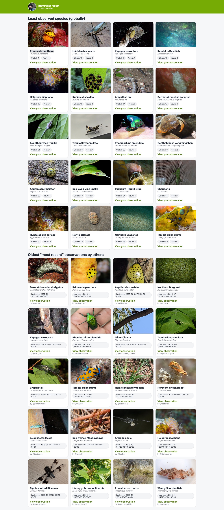

# wanderr's Very Unofficial iNaturalist scripts

## Introduction

This repository is essentially just a dumping ground for my iNat related scripts that, who knows, someone else might find useful. These are not going to be the highest quality, most robust utilities ever created. Most likely they will be "vibe coded" with only confirmation that they work for my own specific use case. These are not official nor affiliated with iNaturalist in any way.

## Rarity Report

I started thinking about rarity as a concept on iNaturalist, like wouldn’t it be cool if you could see your rarest observations? But that raises the question: what counts as rare? I thought it would be interesting to consider rarity through the lenses of "least observed" — species with very few observations, and "least recently observed" - species that haven been observed in a long time.

This consists of two scripts:

1. inat_rarity_reports.php: Given a username, this will create two csv files showing a user's top 20 "rarest" observations by the two different definitions outlined above.
2. inat_rarity_report_to_html.php: This converts the CSVs generated above into a cute little html page with links to the observations.

example usage:
- php inat_rarity_reports.php <username> ./out --sleep=0.5 --max-pages=6 --batch=200
- php inat_rarity_report_to_html.php <username> ./out --sleep=0.05

### Example Report

### Future Improvements

It's annoying that the images of the observations aren't clickable. They should take you to the observation.